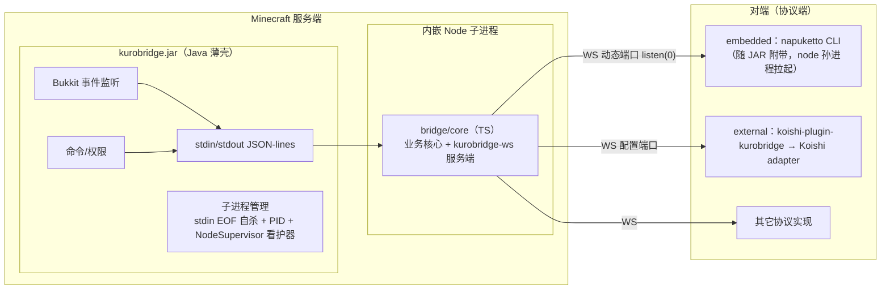

# KuroBridge 架构书

> 状态：**设计定稿（2026-08-10），2026-09-15 按 MVP-1~4 / DEBT-1~2 / 改名后的实现实况校准**。工程体系借鉴 NapukettoQQ（文档分层 / biome+tsconfig / pnpm workspace / 测试设施）。本文是架构 SSOT，改动先更新本文再动代码。

## 1. 定位与范围

KuroBridge = MC 服务器插件（Paper JAR，Java），全自研，MIT 开源。群服互通插件：通过 WebSocket 与机器人框架通信，实现「游戏 ↔ 社交平台」双向互通（QQ / TG / Discord / WhatsApp…）。

```
kurobridge（Paper JAR）—— Java 薄壳 + 内嵌 Node 子进程（TS 业务核心）
```

**核心原则**：
1. **kurobridge 永远是 WS 服务端角色**，对端（协议端）主动连它。embedded / external **不是架构差异，只是打包/配置差异**（config 一个开关）。
2. **kurobridge 只认一套自研协议 `kurobridge-ws`**，不关心对端是谁（内嵌 napukettoqq / 独立 napukettoqq / koishi-plugin-kurobridge / 其它实现）。
3. **业务核心在 Node（TS）侧**，Java 只是 Bukkit 桥接薄壳——开发量 90% 落在 TypeScript。
4. **Koishi 形态 = 站在 Koishi 的 adapter 生态肩膀上**，把全世界社交平台统一成 session 接口；平台渲染（富文本/颜色码/长度收敛）只存在于 koishi-plugin-kurobridge。

## 2. 架构总览



## 3. 两种模式

**没有顶层 `mode` 开关**——差异只在 config 两段（形状 SSOT 归 core zod，ADR-028/029）：

| | embedded（默认不开） | external |
|---|---|---|
| 开法 | `embedded.napuketto.enabled: true`（且强制 `ws.port` 固定端口） | 不配 `embedded` 段；`ws.port` 可固定可缺省（缺省 = 动态端口 + 全部接口） |
| 内嵌 Node 业务核心 | ✅ 拉起 | ✅ 拉起 |
| 协议端 | napuketto CLI（JAR 附带，node 孙进程拉起，控制台扫码） | 外部对端（koishi-plugin-kurobridge 等）连入 |
| 开箱即用 | ✅ | 需另配对端 |
| 架构差异 | **无**，仅打包/配置差异 | |

> 注：早期「external 不拉内嵌进程」的结论已作废（ADR-006）——业务核心在 Node 里，两种模式都必须拉 Node。

## 4. 分层与依赖方向

```
@kuro-bridge/protocol（npm ^0.4.0）  zod schema，姊妹仓 KuroProtocol 发布，零框架依赖（无仓内副本）
   ↑
bridge/core     业务核心 + 协议服务端；零 Node API、零框架（平台无关）
   ↑                    ↑
bridge/embedded   esbuild 单文件（embedded 形态）     platforms/je（Java 薄壳，JSON-lines IPC）
```

> **koishi-plugin-kurobridge 是独立仓库**（ADR-018）：作为 `kurobridge-ws` 的官方参考对端（external 形态），依赖 `@kuro-bridge/protocol` 发布版本，不在本仓库内开发。

**关键规则**：
- `bridge/core` 禁止任何 Node API（`ws`/`process`/`fs`/`pino`），传输层与 logger 均为可注入接口，target ES2020 → **QuickJS（LSE）可跑**。
- Java 薄壳**不含协议逻辑**，只做 Bukkit 桥接 + JSON-lines IPC + 子进程管理。
- 平台渲染只出现在独立仓库 koishi-plugin-kurobridge（本仓库不涉及）。

## 5. 进程模型与 IPC

- **Java ↔ Node**：stdin/stdout **JSON-lines**，零端口零配置（ADR-010）。请求-响应（UUID）+ 事件推送两种帧。
- **Node ↔ 对端**：WS，动态端口 `listen(0)`（embedded，避免僵尸进程占端口）或配置端口（external）。端口号经 IPC 从 Node 回传给 Java（日志展示/管理用）。
- **子进程生命周期**：stdin EOF 自杀（Node 侧）+ PID 文件（`plugins/kurobridge/node.pid`）+
  `NodeSupervisor` 看护器（1s/5s/15s 退避重启，10 分钟窗累计 3 次失败 SEVERE 放弃；
  `runtime.autoRestart: false` 只通知不重启）。

## 6. 业务归属

| 数据/逻辑 | 归属 | 说明 |
|---|---|---|
| 群↔服绑定、白名单、指令权限、转发规则 | **bridge/core（TS）** | 配置 JSON 放 `plugins/kurobridge/`，Node 读写，服主改 JSON |
| Bukkit API 桥接（事件/命令/权限/broadcast/executeCommand） | **Java 薄壳** | 模板化，~几百行 |
| 消息渲染、平台格式收敛 | **koishi-plugin-kurobridge（独立仓库）** | 唯一认识平台的地方（ADR-018） |
| 协议端（QQ 连接） | napukettoqq | 只做协议端，不做业务 |

## 7. 目录树

```
kurobridge/
├── readme.md / AGENTS.md / lefthook.yml / mise.toml
├── package.json（仅脚本 + workspaces）/ pnpm-workspace.yaml
├── biome.jsonc / tsconfig.json / vitest.config.ts / .editorconfig   # 对齐 NapukettoQQ
├── docs/
│   ├── architecture.md（本文）/ DECISIONS.md / STATUS.md / config-schema.md
│   ├── protocol/            # 协议说明文档（peer-guide.md 已退位为迁移指针，权威在 KuroProtocol，ADR-031）
│   └── history/             # 已完成阶段的任务书/实录归档（正文不改写，索引见其 README.md）
├── platforms/
│   ├── je/                  # Java 交付物根（Gradle 多模块：一个服务端 = 一个模块，ADR-019）
│   │   ├── build.gradle.kts / settings.gradle.kts
│   │   ├── core/            # 薄壳核心（IPC 客户端 / 进程管理，零 Bukkit API）
│   │   ├── paper/           # Paper 适配（依赖 :core，产出 shadowJar）
│   │   │   └── src/main/resources/embedded/   # 构建期生成（gitignore）
│   │   ├── fabric/          # Fabric mod 适配（依赖 :core，shadow 白名单→loom remapJar；docs/design.md）
│   │   ├── neoforge/        # 预留：NeoForge mod 适配（依赖 :core）
│   │   └── velocity/        # 预留：Velocity 代理适配（依赖 :core）
│   └── be/                  # BE 服务端家族（基岩版，ADR-020）
│       ├── lse/             # LeviLamina LSE 平台适配（R2′ WS 回环薄壳：QuickJS 壳 + Node shim 宿主 core，ADR-037）
│       │   ├── package.json / tsconfig.json / plugin.json / readme.md（真机 SOP）/ docs/role-adjudication.md（角色 SSOT）
│       │   ├── src/         # 壳（事件桥接 / 看护器 / 游戏通道 WSClient 回环）→ dist/index.js
│       │   └── src/runtime/ # Node shim（宿主 KurobridgeServer/Relay）→ dist/bin/index.mjs
│       └── endstone/        # Endstone 适配（C++ 薄壳 + 内嵌 Node；docs/feasibility.md 裁决册）
│           ├── CMakeLists.txt / CMakePresets.json   # core/windows-clang-cl 双轨（dll 待 clang-cl 解锁）
│           ├── src/         # 薄壳（main 插件入口 / events 四事件桥接 / bridge 请求处理）
│           ├── src/core/    # portable 层（JSON/帧编解码/进程拉起/IPC/看护器，零 endstone 依赖可独立测试）
│           └── tests/       # ctest 五目标（含真实 node.exe 集成，fixtures/stub-node.mjs 桩）
├── bridge/
│   ├── core/                # @kuro-bridge/bridge-core（平台无关）
│   └── embedded/            # 嵌入式瘦身对端（esbuild 单文件，打进 JAR）
├── toolings/                # 工具链（按职责分目录）：packaging/（build-jar.mjs 跨壳全链路 + embed.ts 嵌包）/
│   │                          gates/（门禁：check-docs-{scope,links} / check-versions，共用 lib/ 遍历层）/
│   │                          paper/（沙盒单一入口 paper.cmd：start|stop|cmd|qr，启停走 .sh，cmd|qr 走 .ps1）
└── sandbox/                 # 运行产物全 gitignore（Paper 服务端等；fake-player.mjs 离线假人）
```

> koishi-plugin-kurobridge（external 形态官方对端）在独立仓库开发，不在本目录树内。

未来扩展：`platforms/` 按**技术栈 + 客户端**划分：`je`=Java 服务端（paper/fabric/velocity）、`be`=BE 服务端家族（lse=TS 脚本 / endstone=C++ 薄壳）。Nukkit 已剔除（非主流，2026-08-11）。PocketMine-MP（PHP）工具链不匹配不做。

## 8. 技术栈矩阵

| 模块 | 语言 | 关键依赖 | 构建 | 测试 |
|---|---|---|---|---|
| `bridge/core` | TS | zod、`@kuro-bridge/protocol`（npm ^0.4.0，姊妹仓 KuroProtocol 发布）；零框架零 Node API | tsdown | vitest（+ fast-check，二期） |
| `bridge/embedded` | TS | 无框架 | esbuild 单文件 | 集成测试（起真 WS server） |
| `platforms/je` | Java 21 字节码（工具链 25，target 21） | Paper API（compileOnly）+ fabric-loader/fabric-api（modImplementation，:fabric）+ Jackson | Gradle（:paper shadowJar；:fabric shadow 白名单→loom remapJar） | JUnit 5（:core IPC 编解码 + 进程生命周期；:fabric TPS 自测） |
| `platforms/be/lse` | TS → JS | `@levimc-lse/types` + `@kuro-bridge/bridge-core` + ws（shim 侧） | esbuild 双产物（壳 IIFE target es2020 + Node shim ESM） | vitest（含回环 e2e） |
| `platforms/be/endstone` | **C++ 20** | Endstone API（header-only，CMake FetchContent）+ 内嵌 Node | CMake presets 双轨（core / windows-clang-cl，dll 待 clang-cl） | ctest 五目标（portable 层 + 真实 node 集成） |
| koishi-plugin-kurobridge（独立仓库） | TS | Koishi v4 + `@kuro-bridge/protocol` | Koishi 标准 | vitest + `@koishijs/plugin-mock` |

**苛刻度（对齐 NapukettoQQ）**：
- **TS 侧**：直接沿用 Napuketto 的 biome.jsonc + tsconfig（`erasableSyntaxOnly`、`exactOptionalPropertyTypes`、`noUncheckedIndexedAccess`、`noFloatingPromises`、`noExcessiveCognitiveComplexity(15)`、`useNamingConvention`、`useErrorMessage`、organizeImports 全保留）。一份 biome 配置管 bridge/ + platforms/be/ + toolings/。
- **Java 侧（第一版）**：`-Xlint:all -Werror` + Spotless(Palantir) + JUnit 5（2026-09-18 求真裁决：JaCoCo 覆盖率门禁暂不实装——先让 CI 的 `gradlew build` 成为机器级门禁，覆盖率阈值化待 `:paper` 单测补强后再评估；原文「JaCoCo ≥60% 门禁」无配置支撑，就此清零）。**Error Prone / NullAway 第一版不上**（ADR-011），薄壳定型后再评估。
- **协议防漂移门禁**：消息类型只能 import `@kuro-bridge/protocol`（**导入口径机械强制**：biome
  `style.noRestrictedImports` 禁止绕过包名入口的深路径导入，patterns 维持
  `**/protocol/src/**` + `**/protocol/dist/**`——镜像退役后自然落在 node_modules 产物深路径上；
  2026-09-18 求真裁决落地，原文「lint 规则强制」彼时无配置支撑；「不手写消息类型」为约定 +
  review 把关，该语义无法用 import 规则全量机械化）；改 schema 不更新消费方 → `pnpm check` 红。
  **协议依赖纪律**（ADR-031 阶段 2 / ADR-035）：本仓无协议副本，经 npm 依赖
  `@kuro-bridge/protocol@^0.4.0` 消费；协议演进只能在 KuroProtocol 四件套同改 + 发版，
  本仓升依赖版本号。
- **全仓门禁（一条入口）**：本地 `pnpm check` 一条链覆盖构建首环（ADR-035：先构建发布物，再在
  发布面做全部静态校验）→ 静态检查（biome + 根 tsc + lse typecheck）→ docs 两门禁（docs/history
  外禁无连字符旧 scope 口径 + md 相对链接死链）→ 版本对齐（bridge 六点 + 协议两份——锚 = 已安装
  npm 包 `@kuro-bridge/protocol` 清单 version ≡ `KurobridgeVersions.java`，ADR-034/035）。
  命令明细的单一权威 = 根 `package.json` 的 `check` 脚本（`AGENTS.md` 工作流节有逐段解说），
  本文不复列以免双写漂移。lefthook pre-commit 串行（`parallel: false`，防 build 清空 dist 与
  test 的竞态，ADR-035）跑 `pnpm check` → `pnpm test`，CI（ADR-032，结构经 ADR-035 结论 4 简化：
  无姊妹仓检出）机器级复跑同一命令链 + Java `gradlew build`。

## 9. 嵌入式打包要点（沿用 Napuketto 许可证方案，MVP-4 实况）

- `node.exe`（MIT）→ 进 JAR；**腾讯闭源件（wrapper.node / QQ 安装包 / QQNT 二进制）不进
  JAR**（红线，构建期扫描断言：`toolings/packaging/embed.ts` 打包前断言嵌包树不含 wrapper.node / QQ 安装包 /
  QQNT 二进制，`toolings/packaging/embed.test.ts` 用例覆盖）；napuketto 嵌包仅自研件（其 stub `QQNT.dll` 为 napuketto 自研）。
- 嵌入式打包：`toolings/packaging/embed.ts` 下载/校验 node 官方 dist（win-x64，sha256 对
  SHASUMS256.txt，下载源/缓存可换）+ 收集 napuketto 嵌包（npm 真实文件树 → 零依赖 zip
  writer）→ `embedded/{node.exe, index.mjs, NODE_LICENSE, manifest.json}` + 单一
  `napuketto.zip`（7.6MB）+ `NAPUKETTO_LICENSES` 进各平台模块 resources（`:paper` /
  `:fabric`，目标清单 SSOT = embed.ts `defaultEmbedTargets`）；napuketto 版本
  SSOT = bridge/embedded package.json 精确 pin。多平台矩阵记债务。
- 运行期解压（`:core EmbeddedRuntime`）：manifest sha256 幂等比对（复用/缺失/不符重建）+
  zip slip 防护 + 哨兵 `.kurobridge-install.json` 记 zip sha256（napuketto 同款幂等展开）。
- 端口：external 缺省动态端口 `listen(0)`（避免僵尸进程占端口）；embedded 强制固定端口
  （napuketto 需要知道连哪，缺配快速失败）。
- 子进程生命周期：stdin EOF 自杀 + PID 文件 + NodeSupervisor 看护器（见 §5）。

## 10. 协议

协议契约（`kurobridge-ws`）的权威来源在**姊妹仓 KuroProtocol**（ADR-031）：语义与逐帧字段表 SSOT =
其 `docs/peer-guide.md`（跨仓库契约）；schema 本体与版本 SSOT = 其 `src/`（当前版本以
`KuroProtocol/src/meta.ts` 的 `PROTOCOL_VERSION` 为准，版本演进见其 `docs/changelog.md`）。
本仓无协议副本：schema 经 npm 依赖 `@kuro-bridge/protocol@^0.4.0` 消费，协议版本锚 =
已安装 npm 包清单 version ≡ `KurobridgeVersions.java`（`check-versions` 机械对齐，
等价性依据 = KuroProtocol 发布侧 `assert-version.mjs`，ADR-035），
`docs/protocol/peer-guide.md` 已退位为迁移指针。最早设想见 [history/draft-v0.1.md](history/draft-v0.1.md)（停在 v0.2，仅供考古）。

要点：WS 子协议 `Sec-WebSocket-Protocol: kurobridge-ws.v1`（大版本，握手期拒绝不兼容对端）
+ `hello.protocolVersion` 主版本兼容区间协商（0.2.x 可连 0.3.x/0.4.0 服务端，1.x 拒绝，
ADR-026）；帧 `{ header: { type, id }, body }`；单程握手（Peer `hello` → Server
`hello_ack` 携带 channelBindings 快照，ADR-023）+ `bindings_updated` 全量推送；UUID
请求-响应（`*_result` 显式响应帧，ADR-025）；token 鉴权（非空时 close 1008）；业务心跳 +
服务端空闲检测；未知帧两段式容忍。`msgContinue` 流式回报**未实装**（债务，见 STATUS 债务索引）。

## 11. 红线

1. Java 薄壳不写业务逻辑（绑定/权限/转发）。
2. `bridge/core` 不出现任何 Node API / Koishi API。
3. 消息类型不手写，只 import `@kuro-bridge/protocol`。
4. 不引入 OneBot 11；不复制 HuHoBot / NapCat / NapukettoQQ 代码。
5. 嵌入式打包：`wrapper.node` 不进 JAR（构建期扫描断言，见 §9）。
6. IPC 只用 stdin/stdout JSON-lines，Java 不碰端口。
